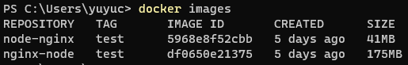
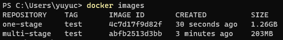

# Docker Example

## Example of Docker based on two base images

You can run the following command to build the image:

```bash
docker build -f ./node-nginx.dockerfile -t node-nginx:test .

# and

docker build -f ./nginx-node.dockerfile -t nginx-node:test .
```



## Example of Docker with multi-stage build

You can run the following command to build the image:

```bash
docker build -f ./multi-stage/next-example/one-stage.dockerfile -t one-stage:test ./multi-stage/next-example

# and

docker build -f ./multi-stage/next-example/multi-stage.dockerfile -t multi-stage:test ./multi-stage/next-example
```


